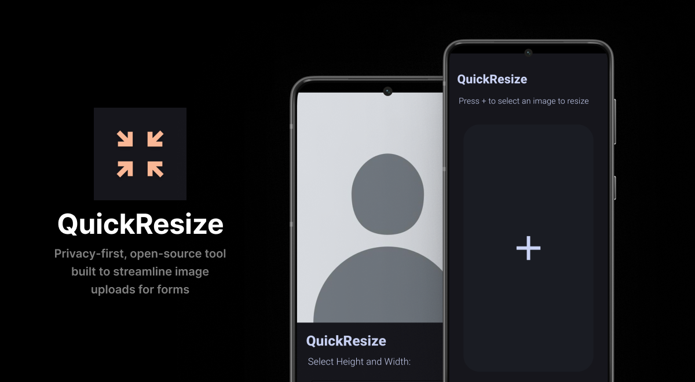

# QuickResize 🔄  
**Resize, Compress, and Comply—All Offline**  

"**Meet QuickResize**—a privacy-first, open-source tool built to streamline image uploads for forms. Resize images to the exact resolution (e.g., 800x600) and compress them to meet strict file size limits (e.g., 200KB) required by online forms, applications, or document submissions. Perfect for job portals, government forms, or school applications, QuickResize ensures your images comply effortlessly without sacrificing quality. Everything happens offline—your data never leaves your device."

---

## 🚀 Features  
- **Form-Ready Compliance**: Set pixel-perfect dimensions (e.g., `800x600`) and shrink files to exact byte limits (e.g., `200KB`).  
- **Offline Privacy**: Process images locally—your data **never leaves your device**.  
- **Open-Source**: Audit, modify, or contribute to the code. Built with transparency.  

---

## 🤝 Contributing

We welcome contributions! Check out our:

## 📜 License

This project is licensed under the MIT License. See LICENSE for details.